# bebop_simulator
A simple bebop simulator for high level controller development. It has been tested on Ubuntu 16.04 (Xenial) with ROS Kinetic.
#### Prerequisite
- [Sphinx](https://developer.parrot.com/docs/sphinx/whatissphinx.html) *Note: you might need to disable the front camera and change the virtual ethernet.*
- [bebop_autonomy](https://bebop-autonomy.readthedocs.io/en/latest/) *Note: remember to change the IP address.*
- [Gazebo](http://gazebosim.org/)
- [nav_msgs](http://wiki.ros.org/nav_msgs)

#### Installation
```
$ cd [ROS_workspace]/src
$ git clone https://github.com/0Jiahao/bebop_simulator.git
$ cd ..
$ catkin build
```

#### Scripts
- **Start.sh**: start the simulation
- **Takeoff.sh**: takeoff
- **Land.sh**: land
- **Reset.sh**: start at the origin and takeoff
- **Random_Reset.sh**: start at a random position with random yaw angle and takeoff

#### Data reading
The ground truth data can be read via topic /simulator/odometry.
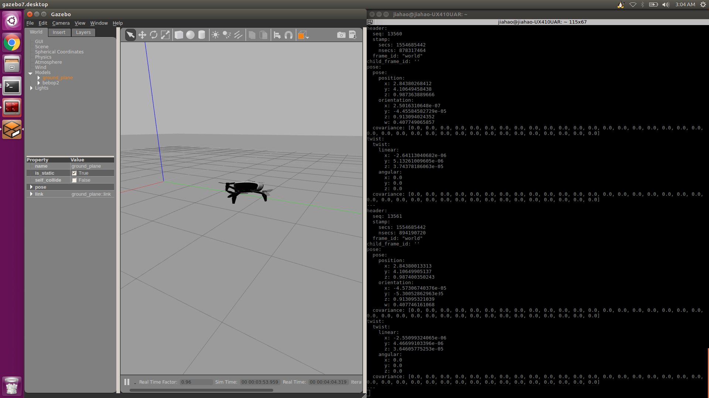

#### Model Identification

Different models are simply estimated, including pitch, roll, and vertical velocity, yawrate, air drag. Some estimated parameter can be found in [results.txt](https://github.com/0Jiahao/bebop_simulator/blob/master/bebop_identification/identification_result/results.txt). We currently using pitch, roll and vertical velocity for system modelling.

**Pitch Model** is a first-order system
<p align="center">
  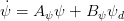
</p>

with constraint
<p align="center">
  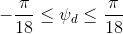
</p>

**Roll Model** is a first-order system
<p align="center">
  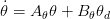
</p>

with constraint
<p align="center">
  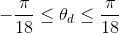
</p>

**Vertical Velocity Model** is a second-order system
<p align="center">
  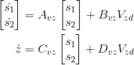
</p>

with constraint
<p align="center">
  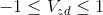
</p>

The **Integrated System** (linearized around stationary) can be written as
<p align="center">
  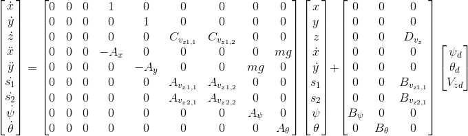
</p>
<p align="center">
  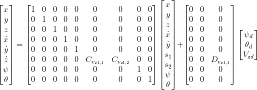
</p>

Note that the 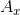 and 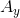 are the estimated coefficients of air drag force.

#### MPC Target Point Tracking
**bebop_mpc** is an example of target-point tracking with a simple linear MPC controller. The result shown below is initialized with a random position and end up with the target point `(5,4,3)`.
<p align="center">
  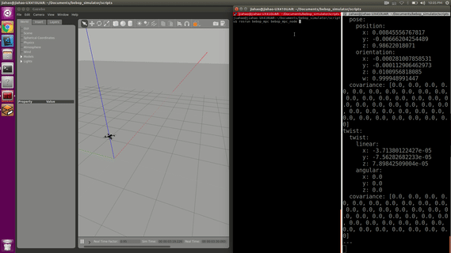
</p>